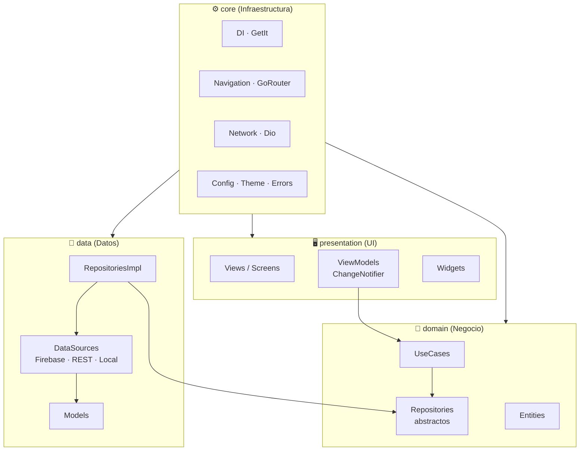

# Flutter Premium Template 🚀


Plantilla base para proyectos Flutter con foco en **Productividad**, **Escalabilidad** y **Estética Premium**.

La base técnica combina **Clean Architecture** + **MVVM** + **POO**.

---

## 📚 Tabla de contenidos

1. [Objetivo](#-objetivo-de-este-readme)
2. [Arquitectura del proyecto](#️-arquitectura-del-proyecto)
3. [Reglas de dependencia](#-reglas-de-dependencia-obligatorias)
4. [Estructura por feature](#-estructura-recomendada-por-feature)
5. [Inicio rápido](#-inicio-rápido-proyecto-actual)
6. [Uso como plantilla](#-uso-como-plantilla-bootstrap)
7. [Stack incluido](#️-stack-incluido)
8. [Autenticación con Firebase](#-autenticación-con-firebase)
9. [Convenciones de nomenclatura](#-convenciones-de-nomenclatura)
10. [Gestión de constantes](#-gestión-de-constantes-no-hardcode)
11. [Patrón Either y manejo de errores](#-patrón-either-y-manejo-de-errores)
12. [Navegación](#-navegación-gorouter)
13. [Gestión de estado](#-gestión-de-estado)
14. [Testing](#-testing-y-validación)
15. [Git workflow](#-git-workflow)
16. [Seguridad](#-seguridad)
17. [i18n](#-convenciones-de-i18n)
18. [Guía de estilo](#-guía-de-estilo)
19. [Definition of Done](#-calidad-mínima-por-feature-definition-of-done)
20. [Configuración de entorno](#-configuración-de-entorno-plantilla)

---

## 🎯 Objetivo de este README

Este documento funciona como **contrato técnico del proyecto**:

- Define la arquitectura y límites entre capas.
- Estandariza nomenclatura, estilo, i18n, responsive y testing.
- Acelera el onboarding de nuevos integrantes.

> Cualquier decisión técnica que contradiga este documento debe ser discutida y aprobada antes de implementarse.

---

## 🏛️ Arquitectura del proyecto

La app está organizada en cuatro capas dentro de `lib/`.



### 1) `domain/` (Negocio)

Núcleo de la aplicación. **No depende** de frameworks, UI ni SDKs externos.

- **Entities**: modelos puros de negocio.
- **Repositories (abstractos)**: contratos de acceso a datos.
- **UseCases**: reglas y operaciones de negocio.

### 2) `data/` (Datos)

Implementa los contratos del dominio.

- **Models**: mapeos/serialización.
- **DataSources**: Firebase, API, local DB, etc.
- **RepositoriesImpl**: implementación concreta de `domain/repositories`.

### 3) `presentation/` (UI)

Pantallas y estado de interfaz.

- **ViewModels**: estado de vistas con `ChangeNotifier` + `Provider`.
- **Views/Screens**: composición de pantallas.
- **Widgets**: componentes reutilizables de UI.

### 4) `core/` (Infraestructura compartida)

Servicios y utilidades transversales.

- **DI**: `GetIt`.
- **Navigation**: `GoRouter`.
- **Network**: cliente HTTP (`Dio`).
- **Config/Theme/Constants/Errors**: soporte común del proyecto.

---

## 🔒 Reglas de dependencia (obligatorias)

### Flujo permitido

- `presentation` → `domain`
- `data` → `domain`
- `core` → usado por todas las capas

### Flujo NO permitido

- `domain` → `data` o `presentation`
- `presentation` → `data` directamente
- Lógica de negocio dentro de widgets

> Regla práctica: toda regla de negocio vive en `usecases`; la UI sólo orquesta y renderiza.

---

## 🧱 Estructura recomendada por feature

```text
lib/
    domain/
        entities/
        repositories/
        usecases/
    data/
        models/
        datasources/
        repositories/
    presentation/
        viewmodels/
        views/
        widgets/
    core/
        config/
        navigation/
        network/
        di/
```

---

## 🚀 Inicio rápido (proyecto actual)

1. Instalar dependencias:

```bash
flutter pub get
```

2. Configurar Firebase (si aplica al entorno):

```bash
flutterfire configure
```

3. Ejecutar la app en **dev** (sin Firebase por defecto):

```bash
flutter run
```

4. Ejecutar en **prod** con configuración por entorno:

```bash
flutter run --dart-define=APP_ENV=prod --dart-define=ENABLE_FIREBASE=true --dart-define=API_BASE_URL=https://api.tudominio.com
```

5. Generar localizaciones (si cambias archivos ARB):

```bash
flutter gen-l10n
```

---

## ⚡ Uso como plantilla (bootstrap)

Para crear una nueva app basada en esta plantilla sin tocar el código original:

```bash
dart scripts/bootstrap.dart
```

Luego ingresa:

- Nombre de app
- ID de organización

### Reglas del bootstrap

- `appName` debe usar `snake_case` (ej: `mi_app`).
- `orgId` debe usar formato de dominio invertido (ej: `com.miempresa`).
- El script omite carpetas de build/herramientas (`build`, `.dart_tool`, `.git`, etc.).
- Ajusta reemplazos de nombre/ID y reorganiza el paquete Android (`MainActivity.kt`) al nuevo namespace.

### Post-bootstrap recomendado

En el proyecto recién creado, ejecuta:

```bash
dart scripts/setup_template.dart
```

Opciones rápidas:

```bash
dart scripts/setup_template.dart --skip-tests
dart scripts/setup_template.dart --skip-analyze
```

Este script automatiza:

- `flutter pub get`
- `flutter gen-l10n`
- `flutter test`
- `flutter analyze`

---

## 🛠️ Stack incluido

- **State Management**: `Provider` + `ChangeNotifier`
- **DI**: `GetIt`
- **Routing**: `GoRouter`
- **Networking**: `Dio`
- **UI**: Material 3 + Google Fonts
- **Backend**: Firebase (Auth + Firestore)
- **i18n**: multi-idioma (`en`/`es`)

---

## 🔐 Autenticación con Firebase

La plantilla integra Firebase Authentication siguiendo la arquitectura limpia definida en el proyecto. Todos los casos de uso de autenticación siguen el flujo:

```
View → ViewModel → UseCase → AuthRepository (abstracto) → FirebaseAuthService (implementación)
```

El contrato del repositorio vive en `domain/repositories/auth_repository.dart` y la implementación concreta en `data/datasources/firebase_auth_service.dart`.

---

### 📋 Casos de uso soportados

| Caso de uso | Método | Retorno |
|---|---|---|
| Iniciar sesión | `signIn(email, password)` | `Either<Failure, void>` |
| Registrar usuario | `signUp(email, password)` | `Either<Failure, void>` |
| Cerrar sesión | `signOut()` | `void` |
| Estado de autenticación | `authStateChanges` | `Stream<bool>` |
| Restablecer contraseña | `resetPassword(email)` | `Either<Failure, void>` |

---

### 1️⃣ Inicio de sesión (Email + Password)

**Flujo:** `LoginView` → `AuthViewModel.signIn()` → `SignInUseCase` → `AuthRepository.signIn()`

```dart
// domain/usecases/sign_in_usecase.dart
class SignInUseCase {
  SignInUseCase(this.repository);
  final AuthRepository repository;

  Future<Either<Failure, void>> call(String email, String password) =>
      repository.signIn(email, password);
}
```

```dart
// presentation/viewmodel/auth_viewmodel.dart
Future<void> signIn(String email, String password) async {
  _state = AuthState.loading;
  notifyListeners();
  final result = await _signInUseCase(email, password);
  result.fold(
    (failure) { _state = AuthState.error; _errorMessage = failure.message; },
    (_)       { _state = AuthState.authenticated; },
  );
  notifyListeners();
}
```

> **Errores comunes Firebase:** `user-not-found`, `wrong-password`, `invalid-email`, `user-disabled`.  
> Mapearlos en `core/errors/failures.dart` para mostrar mensajes localizados.

---

### 2️⃣ Registro de usuario (Email + Password)

**Flujo:** `RegisterView` → `AuthViewModel.signUp()` → `SignUpUseCase` → `AuthRepository.signUp()`

```dart
// domain/usecases/sign_up_usecase.dart
class SignUpUseCase {
  SignUpUseCase(this.repository);
  final AuthRepository repository;

  Future<Either<Failure, void>> call(String email, String password) =>
      repository.signUp(email, password);
}
```

```dart
// data/datasources/firebase_auth_service.dart
@override
Future<Either<Failure, void>> signUp(String email, String password) async {
  try {
    await _firebaseAuth.createUserWithEmailAndPassword(
      email: email,
      password: password,
    );
    return const Right(null);
  } catch (e) {
    return Left(FirebaseFailure(e.toString()));
  }
}
```

> **Errores comunes Firebase:** `email-already-in-use`, `weak-password`, `invalid-email`.

---

### 3️⃣ Cierre de sesión

**Flujo:** `ViewModel.signOut()` → `AuthRepository.signOut()`

```dart
// presentation/viewmodel/auth_viewmodel.dart
Future<void> signOut() async {
  await _authRepository.signOut();
  _state = AuthState.unauthenticated;
  notifyListeners();
}
```

```dart
// data/datasources/firebase_auth_service.dart
@override
Future<void> signOut() async {
  await _firebaseAuth.signOut();
}
```

---

### 4️⃣ Estado de autenticación reactivo

El stream `authStateChanges` se usa para proteger rutas y redirigir automáticamente al usuario. Se conecta al router via `GoRouter` con un `refreshListenable`.

```dart
// domain/repositories/auth_repository.dart
Stream<bool> get authStateChanges;
```

```dart
// data/datasources/firebase_auth_service.dart
@override
Stream<bool> get authStateChanges =>
    _firebaseAuth.authStateChanges().map((user) => user != null);
```

```dart
// core/navigation/app_router.dart
GoRouter(
  refreshListenable: authNotifier, // escucha el stream de auth
  redirect: (context, state) {
    final isAuth = authNotifier.isAuthenticated;
    final isLoginRoute = state.matchedLocation == '/login';
    if (!isAuth && !isLoginRoute) return '/login';
    if (isAuth && isLoginRoute) return '/home';
    return null;
  },
  routes: [...],
)
```

---

### 5️⃣ Restablecimiento de contraseña

**Flujo:** `ForgotPasswordView` → `AuthViewModel.resetPassword()` → `ResetPasswordUseCase` → `AuthRepository.resetPassword()`

Añadir al contrato del repositorio:

```dart
// domain/repositories/auth_repository.dart
Future<Either<Failure, void>> resetPassword(String email);
```

Implementación en el servicio:

```dart
// data/datasources/firebase_auth_service.dart
@override
Future<Either<Failure, void>> resetPassword(String email) async {
  try {
    await _firebaseAuth.sendPasswordResetEmail(email: email);
    return const Right(null);
  } catch (e) {
    return Left(FirebaseFailure(e.toString()));
  }
}
```

> Firebase envía el correo de recuperación al email registrado. Verificar que el dominio esté autorizado en Firebase Console → Authentication → Settings → Authorized domains.

---

### 🏗️ Estructura de archivos de autenticación

```text
lib/
  domain/
    entities/
      app_user.dart               ← entidad de usuario (id, email, displayName)
    repositories/
      auth_repository.dart        ← contrato abstracto
    usecases/
      sign_in_usecase.dart
      sign_up_usecase.dart
      sign_out_usecase.dart
      reset_password_usecase.dart
      get_auth_state_usecase.dart
  data/
    datasources/
      firebase_auth_service.dart  ← implementación Firebase
  presentation/
    viewmodel/
      auth_viewmodel.dart         ← estado de autenticación (AuthState enum)
    view/
      login/
        login_screen.dart
        widgets/
          area_login_form.dart
      register/
        register_screen.dart
      forgot_password/
        forgot_password_screen.dart
```

---

### ⚙️ Registro en el contenedor de DI (GetIt)

```dart
// core/di/injection_container.dart

// External
sl.registerLazySingleton(() => FirebaseAuth.instance);

// Data source / Repository
sl.registerLazySingleton<AuthRepository>(() => FirebaseAuthService(sl()));

// Use cases
sl.registerLazySingleton(() => SignInUseCase(sl()));
sl.registerLazySingleton(() => SignUpUseCase(sl()));
sl.registerLazySingleton(() => SignOutUseCase(sl()));
sl.registerLazySingleton(() => ResetPasswordUseCase(sl()));
sl.registerLazySingleton(() => GetAuthStateUseCase(sl()));

// ViewModel
sl.registerFactory(() => AuthViewModel(
  signInUseCase: sl(),
  signUpUseCase: sl(),
  signOutUseCase: sl(),
  resetPasswordUseCase: sl(),
  getAuthStateUseCase: sl(),
));
```

---

### 🚫 Estados de error de Firebase Auth

Centralizar el mapeo de errores en `core/errors/failures.dart`:

```dart
FirebaseAuthException → FirebaseFailure(message)
```

| Código Firebase | Mensaje recomendado (i18n key) |
|---|---|
| `user-not-found` | `auth.error.userNotFound` |
| `wrong-password` | `auth.error.wrongPassword` |
| `email-already-in-use` | `auth.error.emailInUse` |
| `weak-password` | `auth.error.weakPassword` |
| `invalid-email` | `auth.error.invalidEmail` |
| `user-disabled` | `auth.error.userDisabled` |
| `network-request-failed` | `auth.error.networkError` |
| `too-many-requests` | `auth.error.tooManyRequests` |

---

### ✅ Definition of Done — feature de autenticación

- [ ] `AuthRepository` abstracto con todos los métodos definidos
- [ ] `FirebaseAuthService` implementa todos los métodos del contrato
- [ ] Un `UseCase` por operación de autenticación
- [ ] `AuthViewModel` con enum de estados (`loading`, `authenticated`, `unauthenticated`, `error`)
- [ ] Errores de Firebase mapeados a `Failure` con mensajes localizados
- [ ] Rutas protegidas via `GoRouter` redirect basado en `authStateChanges`
- [ ] Tests unitarios para cada `UseCase` con mock del `AuthRepository`
- [ ] `flutter analyze` sin issues críticos

---

## ✏️ Convenciones de nomenclatura

Seguir estas reglas **sin excepción** garantiza consistencia y legibilidad en todo el equipo.

| Elemento | Convención | Ejemplo |
|---|---|---|
| Ficheros | `snake_case` | `auth_viewmodel.dart` |
| Clases | `PascalCase` | `AuthViewModel` |
| Variables / métodos | `camelCase` | `isLoading`, `signIn()` |
| Constantes globales | `SCREAMING_SNAKE_CASE` | `AppConstants.API_TIMEOUT` |
| Privados | prefijo `_` | `_firebaseAuth` |
| Screens | sufijo `Screen` | `LoginScreen` |
| ViewModels | sufijo `ViewModel` | `AuthViewModel` |
| Use Cases | sufijo `UseCase` | `SignInUseCase` |
| Repositorios abstractos | sufijo `Repository` | `AuthRepository` |
| Implementaciones | sufijo `Impl` o `Service` | `FirebaseAuthService` |
| Widgets reutilizables | sufijo `Widget` o nombre descriptivo | `PrimaryButton` |
| Enums | `PascalCase`, valores `camelCase` | `AuthState.loading` |

---

## 📦 Gestión de constantes (no-hardcode)

**Regla fundamental:** ningún string, número o ruta debe estar literal en el código de UI o lógica.

```text
core/
  constants/
    app_constants.dart    ← timeouts, límites de paginación, tamaños
    route_names.dart      ← nombres de rutas GoRouter
    asset_paths.dart      ← rutas a assets locales
```

```dart
// ❌ MAL — hardcode disperso
GoRoute(path: '/login', ...)
const EdgeInsets.all(16)
Image.asset('assets/images/logo.png')

// ✅ BIEN — centralizado
GoRoute(path: RouteNames.login, ...)
const EdgeInsets.all(AppConstants.spacingM)
Image.asset(AssetPaths.logo)
```

```dart
// core/constants/app_constants.dart
abstract class AppConstants {
  static const double spacingXS = 4;
  static const double spacingS  = 8;
  static const double spacingM  = 16;
  static const double spacingL  = 24;
  static const double spacingXL = 32;
  static const int apiTimeoutSeconds = 30;
}

// core/constants/route_names.dart
abstract class RouteNames {
  static const String home          = '/';
  static const String login         = '/login';
  static const String register      = '/register';
  static const String forgotPassword = '/forgot-password';
}
```

---

## 🔀 Patrón Either y manejo de errores

La plantilla usa `dartz` para manejar errores de forma **funcional y tipada**, evitando excepciones no controladas en la capa de presentación.

### ¿Qué es `Either<L, R>`?

- `Left(failure)` → representa un **error** (tipo `Failure`)
- `Right(value)` → representa un **éxito** (tipo del resultado)

```dart
// UseCase retorna Either
Future<Either<Failure, UserProfile>> call(String uid) =>
    repository.getUserProfile(uid);

// ViewModel consume con .fold()
final result = await _useCase(uid);
result.fold(
  (failure) => _showError(failure.message),  // Left
  (user)    => _state = UserState(user),     // Right
);
```

### Jerarquía de Failures (`core/errors/failures.dart`)

```dart
abstract class Failure {
  const Failure([this.message = '']);
  final String message;
}

class ServerFailure    extends Failure { ... }
class NetworkFailure   extends Failure { ... }
class CacheFailure     extends Failure { ... }
class FirebaseFailure  extends Failure { ... }
class FirestoreFailure extends FirebaseFailure { ... }
class ValidationFailure extends Failure { ... }  // ← para validaciones de formulario
```

### Presentación de errores en UI

```dart
// ✅ Patrón estándar en ViewModel
result.fold(
  (failure) {
    _errorMessage = _mapFailureToMessage(failure);
    _state = MyState.error;
    notifyListeners();
  },
  (data) { ... },
);

// Separar la lógica de mapeo
String _mapFailureToMessage(Failure failure) {
  return switch (failure) {
    NetworkFailure()  => l10n.errorNetwork,
    ServerFailure()   => l10n.errorServer,
    FirebaseFailure() => l10n.errorFirebase,
    _                 => l10n.errorUnknown,
  };
}
```

---

## 🧭 Navegación (GoRouter)

### Reglas de uso

1. **Todas las rutas** deben estar definidas en `core/navigation/app_router.dart`.
2. **Todos los nombres de ruta** deben vivir en `core/constants/route_names.dart`.
3. **Navegar siempre con nombre**, nunca con path literal.

```dart
// ❌ MAL
context.go('/login');

// ✅ BIEN
context.goNamed(RouteNames.login);
```

### Cómo añadir una nueva ruta

1. Añadir la constante en `route_names.dart`.
2. Crear el `GoRoute` en `app_router.dart`.
3. Si requiere autenticación, la lógica de `redirect` en el router lo gestiona automáticamente.

### Paso de parámetros

```dart
// Navegación con parámetros
context.goNamed(RouteNames.profile, pathParameters: {'userId': user.id});

// Recibir en el builder
GoRoute(
  path: '/profile/:userId',
  name: RouteNames.profile,
  builder: (context, state) {
    final userId = state.pathParameters['userId']!;
    return ProfileScreen(userId: userId);
  },
),
```

---

## 🔄 Gestión de estado

### Cuándo usar cada mecanismo de GetIt

| Registro | Cuándo usarlo |
|---|---|
| `registerFactory` | ViewModels — nuevo instancia por pantalla |
| `registerLazySingleton` | Repositorios, UseCases, Services — compartidos |
| `registerSingleton` | Instancias que deben inicializarse al arranque |

### Cuándo usar cada mecanismo de Provider

| Método | Cuándo usarlo |
|---|---|
| `context.watch<T>()` | En `build()` cuando el widget debe rebuildearse |
| `context.read<T>()` | En callbacks/eventos, sin trigger de rebuild |
| `context.select<T, R>()` | Para escuchar solo una propiedad del ViewModel |
| `Consumer<T>` | Para limitar el rebuild a un subtree concreto |

```dart
// ✅ Evitar rebuilds innecesarios con select
context.select<AuthViewModel, bool>((vm) => vm.isLoading)

// ✅ En callbacks, siempre read (no watch)
ElevatedButton(
  onPressed: () => context.read<AuthViewModel>().signIn(email, password),
  child: Text(l10n.signIn),
)
```

---

## 🧪 Testing y validación

### Estrategia de testing

| Tipo | Qué testear | Herramienta |
|---|---|---|
| **Unit tests** | UseCases, ViewModels, mappers | `flutter_test` + `mocktail` |
| **Widget tests** | Widgets críticos con estado | `flutter_test` |
| **Integration tests** | Flujos completos (opcional) | `integration_test` |

### Estructura de `test/` (espeja `lib/`)

```text
test/
  domain/
    usecases/
      sign_in_usecase_test.dart
  data/
    datasources/
      firebase_auth_service_test.dart
  presentation/
    viewmodel/
      auth_viewmodel_test.dart
```

### Ejemplo de test de UseCase con mocktail

```dart
// test/domain/usecases/sign_in_usecase_test.dart
import 'package:mocktail/mocktail.dart';
import 'package:flutter_test/flutter_test.dart';
import 'package:dartz/dartz.dart';

class MockAuthRepository extends Mock implements AuthRepository {}

void main() {
  late SignInUseCase useCase;
  late MockAuthRepository mockRepo;

  setUp(() {
    mockRepo = MockAuthRepository();
    useCase = SignInUseCase(mockRepo);
  });

  test('debe retornar Right(null) en login exitoso', () async {
    when(() => mockRepo.signIn(any(), any()))
        .thenAnswer((_) async => const Right(null));

    final result = await useCase('email@test.com', 'password123');

    expect(result, const Right(null));
    verify(() => mockRepo.signIn('email@test.com', 'password123')).called(1);
  });

  test('debe retornar Left(FirebaseFailure) en credenciales incorrectas', () async {
    when(() => mockRepo.signIn(any(), any()))
        .thenAnswer((_) async => const Left(FirebaseFailure('wrong-password')));

    final result = await useCase('email@test.com', 'wrong');

    expect(result.isLeft(), true);
  });
}
```

### Cobertura mínima recomendada

- **UseCases**: 100 %
- **ViewModels**: ≥ 80 %
- **Repositories / DataSources**: ≥ 70 %

---

## 🌿 Git workflow

### Branching strategy

```
main          ← producción, protegida, solo merge desde develop
develop       ← integración, base de trabajo del equipo
feature/*     ← nuevas funcionalidades  (feature/auth-login)
fix/*         ← corrección de bugs      (fix/login-crash)
hotfix/*      ← parches urgentes a main (hotfix/token-expiry)
chore/*       ← tareas de mantenimiento (chore/update-deps)
```

### Formato de commits (Conventional Commits)

```
<tipo>(<scope>): <descripción en imperativo>

feat(auth): add forgot password flow
fix(login): handle network timeout error
chore(deps): upgrade firebase_auth to 6.1.4
refactor(router): centralize route names in constants
test(auth): add unit tests for SignInUseCase
docs(readme): update architecture diagram
```

| Tipo | Cuándo |
|---|---|
| `feat` | Nueva funcionalidad |
| `fix` | Corrección de bug |
| `refactor` | Refactoring sin cambio de comportamiento |
| `test` | Añadir o modificar tests |
| `chore` | Mantenimiento (deps, CI, scripts) |
| `docs` | Solo documentación |
| `style` | Formato de código (sin lógica) |

---

## 🔒 Seguridad

### Reglas obligatorias

- **Nunca commitear** `.env`, `google-services.json` ni `GoogleService-Info.plist` con credenciales reales.
- Añadir siempre al `.gitignore`:

```gitignore
.env
android/app/google-services.json
ios/Runner/GoogleService-Info.plist
```

- Datos sensibles en runtime → usar `flutter_secure_storage` (ya incluido).

```dart
// ✅ Guardar token de sesión de forma segura
await sl<SecurityService>().write(key: 'auth_token', value: token);
final token = await sl<SecurityService>().read(key: 'auth_token');
```

### Build de producción con ofuscación

```bash
# Android
flutter build apk --obfuscate --split-debug-info=build/debug-info

# iOS
flutter build ipa --obfuscate --split-debug-info=build/debug-info
```

### Variables de entorno — tabla completa

| Variable | Tipo | Default | Descripción |
|---|---|---|---|
| `APP_ENV` | `String` | `dev` | Entorno activo (`dev` / `prod`) |
| `API_BASE_URL` | `String` | (ver AppConfig) | URL base de la API REST |
| `ENABLE_FIREBASE` | `bool` | `false` | Activa servicios Firebase |

---

## 🌍 Convenciones de i18n


- No hardcodear textos en UI — usar siempre claves ARB.
- Centralizar claves por módulo: `auth.login.title`, `auth.error.wrongPassword`.
- Mantener consistencia de naming: `módulo.contexto.elemento`.
- Considerar pluralización (`{count, plural, ...}`) y parámetros dinámicos desde el inicio.
- Formato de clave: `camelCase` dentro de cada segmento.

---

## 🎨 Guía de estilo

- Usar `ColorScheme.fromSeed` (sin hardcodear nuevos colores fuera del sistema).
- Mantener tipografía oficial del proyecto (`Outfit`).
- Reutilizar widgets de `presentation/widgets` antes de crear nuevos.
- Mantener diseño responsive para móvil, tablet y desktop.
- Conservar coherencia visual entre pantallas nuevas y existentes.
- Usar siempre `const` en constructores de widgets cuando sea posible.
- Evitar lógica dentro del método `build()` — extraer a métodos o widgets propios.

---

## ✅ Calidad mínima por feature (Definition of Done)

Una tarea se considera **terminada** cuando cumple **todos** los puntos:

- [ ] Arquitectura respetada (sin romper reglas de dependencia)
- [ ] Convenciones de nomenclatura aplicadas
- [ ] Sin valores hardcodeados (strings, números, rutas)
- [ ] Textos internacionalizados (`en` y `es`)
- [ ] Comportamiento responsive validado (móvil, tablet)
- [ ] Tests unitarios añadidos/actualizados (cobertura mínima cumplida)
- [ ] `flutter analyze` sin issues críticos
- [ ] Navegación integrada con `RouteNames` y guards correctos
- [ ] Estados de error manejados con `Either<Failure, T>` y mensajes localizados
- [ ] Commits en formato Conventional Commits
- [ ] Code review aprobado por al menos 1 desarrollador senior

---

## 🧪 Comandos de validación

```bash
# Análisis estático
flutter analyze

# Tests unitarios y widget tests
flutter test

# Con reporte de cobertura
flutter test --coverage
genhtml coverage/lcov.info -o coverage/html

# Build de producción (validar que compila)
flutter build apk --dart-define=APP_ENV=prod --dart-define=ENABLE_FIREBASE=true

# Build con ofuscación
flutter build apk --obfuscate --split-debug-info=build/debug-info \
  --dart-define=APP_ENV=prod --dart-define=ENABLE_FIREBASE=true
```

---

*Mantenido con ❤️ para un desarrollo rápido, consistente y profesional.*